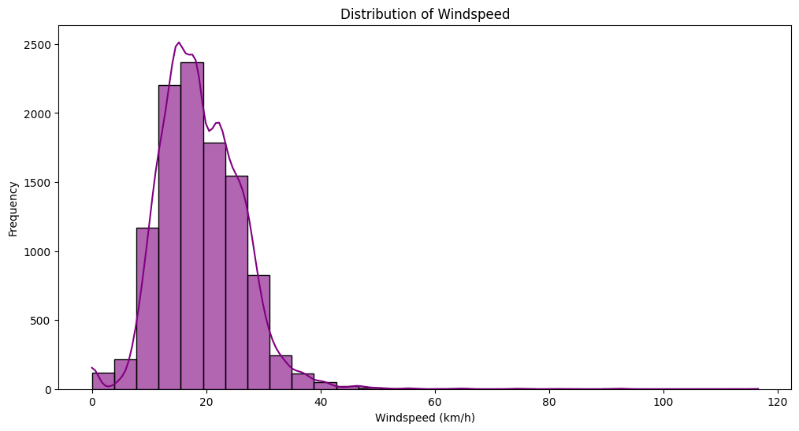
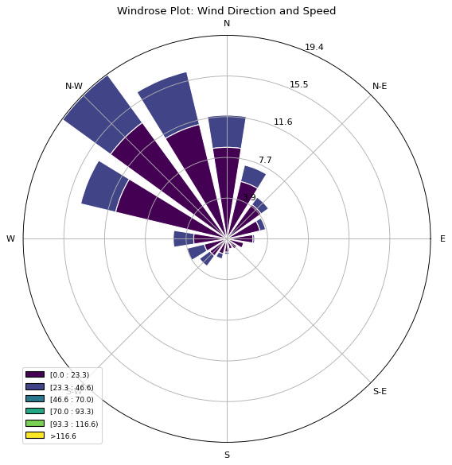
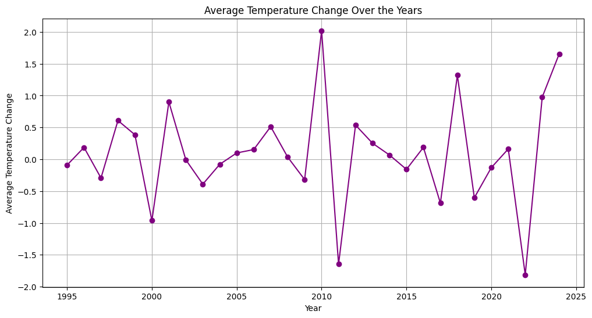
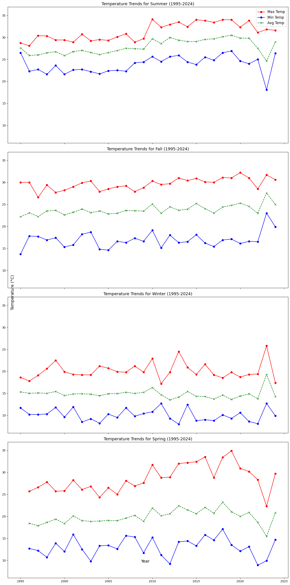
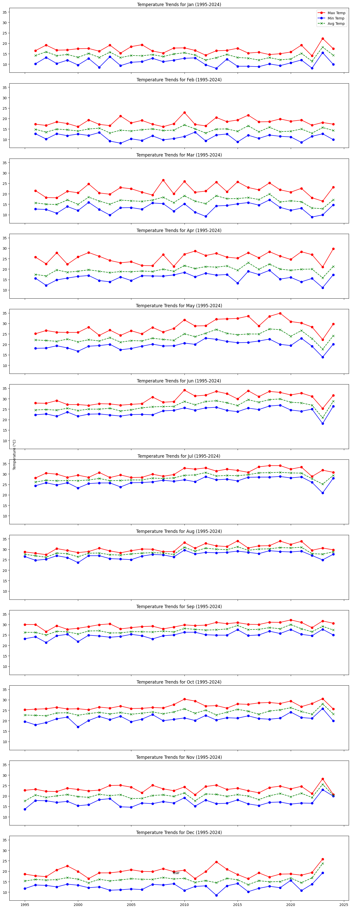
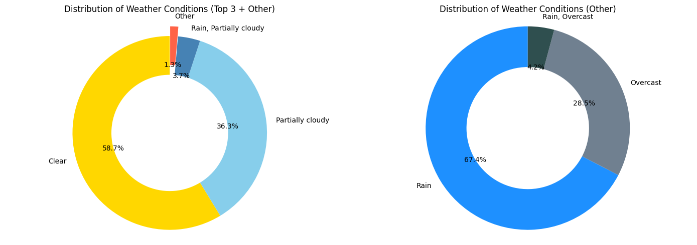
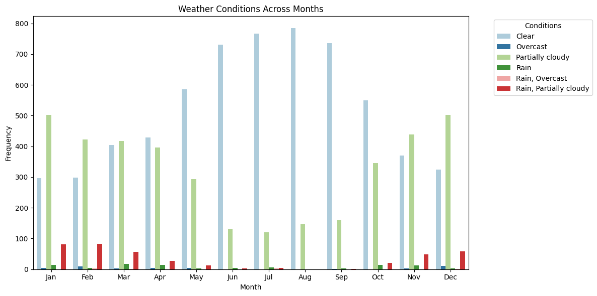

# Comprehensive Weather Analytics: Mansoura (1994-2024)

## Overview
- Thirty years of daily weather observations for Mansoura, Egypt were cleaned, merged, and modelled to understand local climate behaviour between August 1994 and June 2024.
- The project walks through an end-to-end data science workflow: ingestion, preprocessing, exploratory analysis, feature engineering, supervised learning, and diagnostic evaluation.
- Work was completed as a training capstone, emphasising practical handling of messy multi-format data and rapid iteration on baseline and tree-based models.

## Repository Map
- `final-project-weather.ipynb` - main notebook covering data cleaning, feature engineering, exploratory plots, and machine-learning experiments.
- `data/` - historical raw exports for Mansoura (mixed CSV/Excel formats prior to harmonisation).
- `reprot/` - saved visual assets grouped by topic (`temp`, `windspeed`, `time`, `Solar`, `dumidity`, `Categorical`); paths below reference this folder directly.

## Dataset & Coverage
- **Location:** Mansoura, Egypt.
- **Range:** August 1994 to June 2024 (approx. 30 years of daily records).
- **Granularity:** Daily measurements with engineered temporal aggregations (weekly, monthly, seasonal).
- **Key attributes:** temperature extrema, apparent temperature, humidity, wind speed & direction, solar radiation/energy, precipitation metrics, cloud cover, moon phase, categorical weather condition, and engineered rolling/delta features.

## Preprocessing & Feature Engineering Highlights
- Normalised inconsistent column names and encodings across heterogeneous source files.
- Imputed sparse gaps, coerced time fields to a unified datetime index, and enriched the dataset with calendar intelligence (day/week/month/season/year).
- Built lag, delta, and rolling-window statistics (`temp_change`, `prev_year_month_temp_std`, `temp_7d_avg`, `wind_30d_avg`, `humidity_7d_avg`, etc.) to boost predictive signal.
- Encoded `temp_category`, a three-class label comparing each day's temperature to the same calendar day one year earlier (Higher / Normal / Lower).
- Preserved clean train/test splits while scaling or encoding features as required by each algorithm family.

## Modelling Summary
Two target formulations were explored: (1) regression on normalised daily temperature, and (2) multi-class classification of temperature deltas.

### Regression (predicting normalised daily temperature)

| Model | Test R^2 | MAE | RMSE | Notes |
| --- | --- | --- | --- | --- |
| Ridge Regression | 0.983 | 0.0217 | 0.0275 | Best-performing linear model with excellent generalisation. |
| Linear Regression | 0.983 | 0.0219 | 0.0280 | Baseline closed-form solution matching Ridge after feature scaling. |
| Random Forest Regressor | 0.960 | 0.0325 | 0.0426 | Captures non-linearity, slightly higher error but robust to outliers. |

Additional models (SVR, Gradient Boosting, Decision Tree, SGD, KNN, Lasso) were benchmarked; Ridge/OLS provided the top balance of bias/variance, while complex ensembles tended to overfit without tuning.

### Classification (`temp_category` prediction)

| Model | Accuracy | Precision | Recall | F1 | Notes |
| --- | --- | --- | --- | --- | --- |
| Gradient Boosting Classifier | 1.000 | 1.00 | 1.00 | 1.00 | Perfect scores indicate likely overfit on this split; requires cross-validation. |
| Decision Tree Classifier | 0.937 | 0.94 | 0.94 | 0.94 | Strong baseline with interpretable splits. |
| Random Forest Classifier | 0.932 | 0.93 | 0.95 | 0.93 | Balanced performance, slightly higher recall for "Higher" class. |
| Logistic Regression | 0.929 | 0.95 | 0.92 | 0.93 | Reliable linear baseline; triggered sklearn warnings due to class separation but metrics remain stable. |

Naive Bayes and KNN struggled with class imbalance and produced <0.55 accuracy.

### Aggregated Evaluation
- Weekly resampling (mode values) retained high skill with **R^2 approx. 0.91** and **RMSE approx. 0.062**, affirming short-term predictive utility.
- Monthly aggregation (mode) achieved **R^2 approx. 0.82**; seasonal mode dropped to **R^2 approx. 0.64**, signalling that coarse averages reduce model signal.
- Minimum/maximum aggregates suffered degraded fit versus mode, suggesting the learned relationships favour typical mid-range behaviour.

## Visual Insights

### Wind Patterns
- Prevailing winds concentrate in the western and north-western quadrants, with most days recording speeds below 40 km/h.
- Distribution and windrose plots are saved in `reprot/windspeed`.




### Temperature Trends
- Year-on-year averages show a gradual warming trend with notable spikes around 2010 and early 2020s.
- Multi-scale views (year, season, month, week, day) highlight the pronounced summer peaks and mild winters typical of the region.
- Seasonal panels reveal warming summers and springs, while winters remain comparatively stable.





### Time-Series Quality Checks
- Visual comparison before/after date fixes confirms artefacts removed from the original time index.


### Weather Conditions Breakdown
- Clear and partially cloudy conditions dominate the record, with rain-related events forming a small fraction.
- Monthly breakdown underscores the sharp seasonal split between dry, hot summers and wetter winter months.




## How to Run the Notebook
```bash
# 1. Create & activate a virtual environment (Windows example)
python -m venv .venv
.venv\Scripts\activate

# 2. Install core dependencies
pip install pandas numpy matplotlib seaborn scikit-learn windrose

# 3. Launch the notebook interface
jupyter notebook final-project-weather.ipynb
```
> The notebook was authored with Python 3.12; earlier versions of scikit-learn may require minor API adjustments.

## Next Steps
- Add cross-validation, grid/random search, and probability calibration to mitigate overfitting (especially for boosting models).
- Introduce time-series specific baselines (SARIMAX/Prophet/LSTM) to benchmark against tree-based approaches.
- Package reusable feature engineering utilities and expose them via a small library or pipeline script.
- Build an interactive dashboard (e.g., Plotly Dash or Power BI) for stakeholders to explore the 30-year climatology.

## Acknowledgements
- Developed as part of a machine-learning training programme using historical records sourced from commercial weather providers for Mansoura, Egypt.

